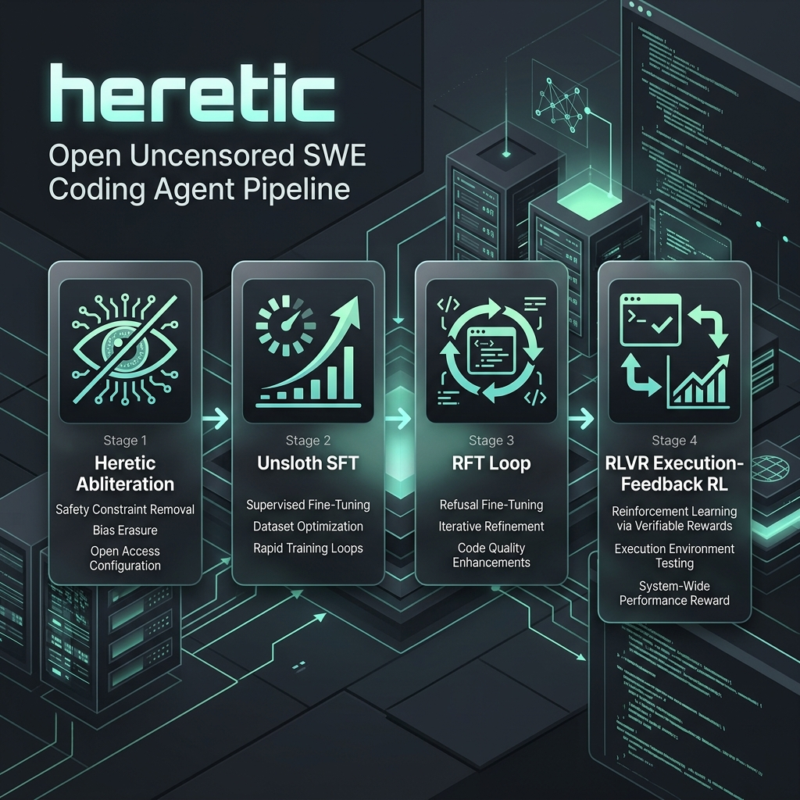
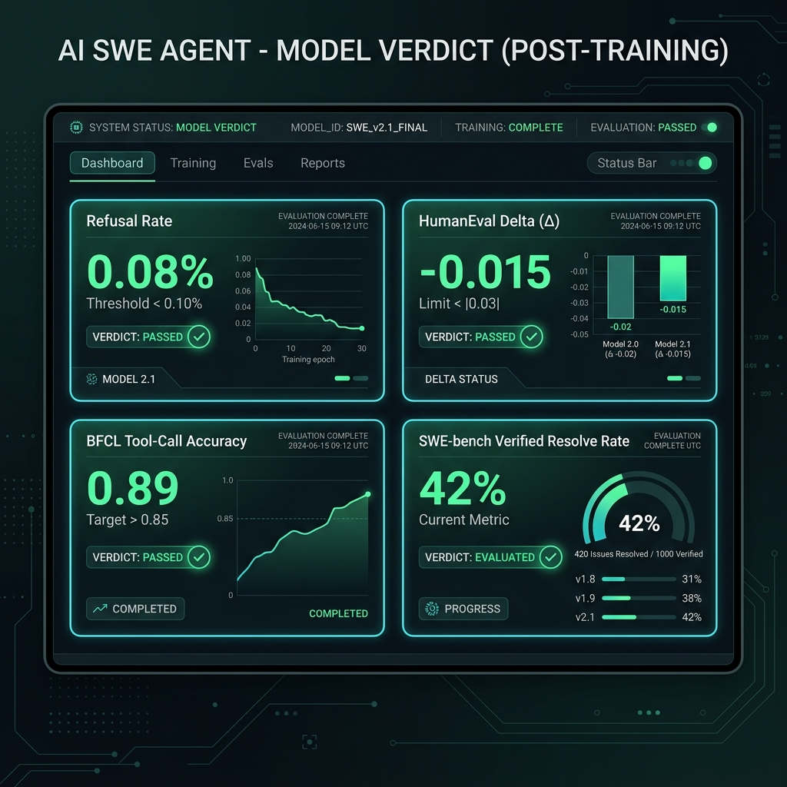
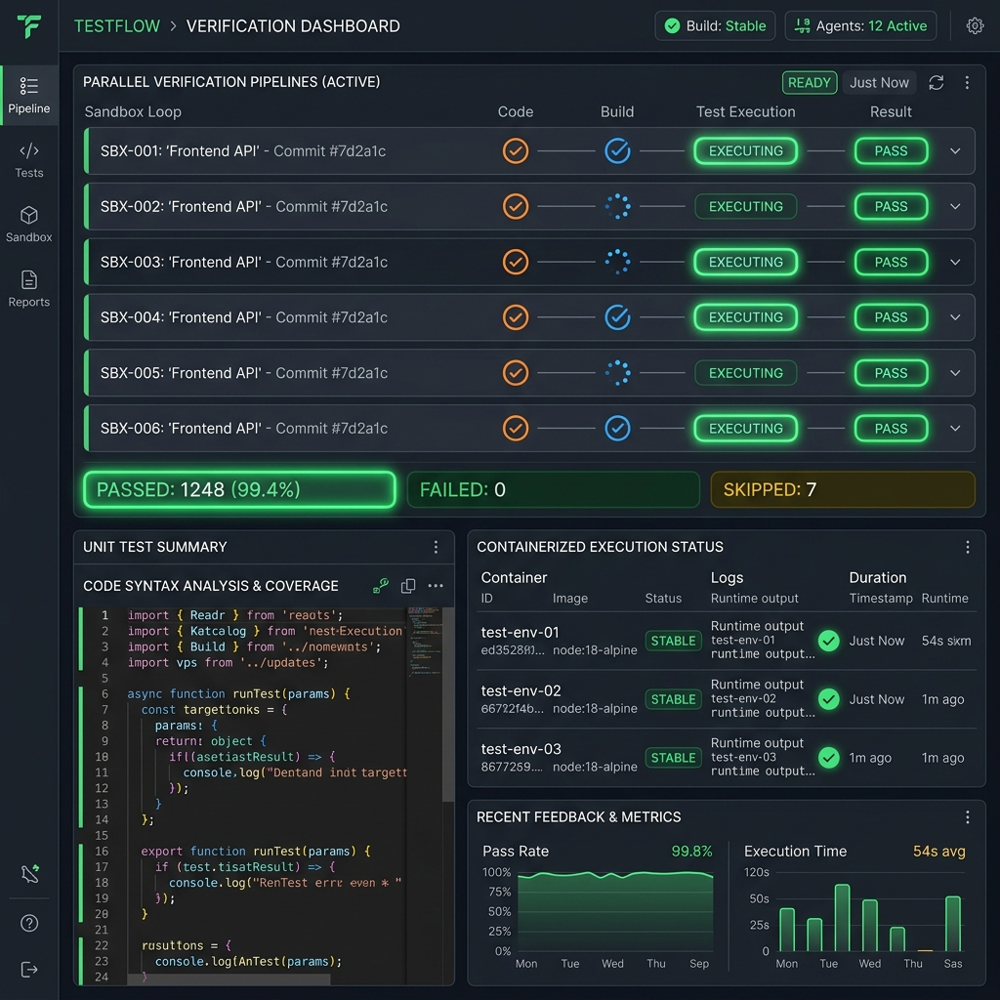
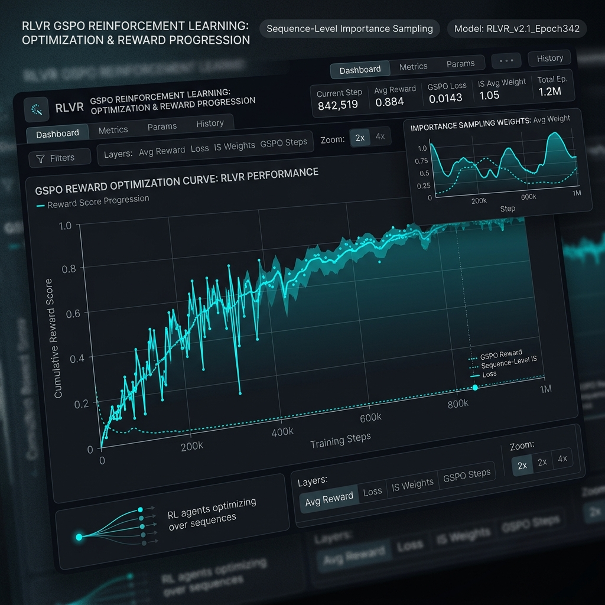

# heretic → SFT → RFT → RLVR — an open uncensored SWE coding-agent pipeline



A reproducible post-training pipeline that turns an open-weight base model into a
strong autonomous software-engineering agent: uncensored (refusal directions
abliterated), tool-call-accurate, with coding ability recovered through
execution-feedback RL. Each stage is a self-contained GPU harness; a top-level
orchestrator chains them.

**Frontier target:** `openai/gpt-oss-120b` (117B total / 5.1B active MoE, harmony
format, Apache-2.0). `Qwen2.5-Coder-32B` is the cheap validation baseline (the
whole harness is model-family-aware and runs either).

> **Status:** harness complete and verified — 300+ unit tests, GPU-free imports,
> per-stage isolation. The **gpt-oss-120b Stage-1 abliteration is running** on
> 2×H200 (verified live to abliterate the fused MoE experts, not just `o_proj` —
> see the fix below). The Qwen2.5-Coder-32B baseline is **shipped** through
> abliteration + SFT (`PeetPedro/qwen2.5-coder-32b-instruct-heretic-sft`). Heavy
> training/eval libs are lazy-imported and mocked in tests — see
> [Before a real run](#before-a-real-run).

## Pipeline

```
base model (gpt-oss-120b / Qwen2.5-Coder-32B)
        │
        ▼
   [1] Heretic       weight surgery — abliterate refusals (bf16 direct-tensor: o_proj + fused MoE experts)
        │
        ▼
   [2] SFT           Unsloth LoRA — agentic SWE + tool-calling data (harmony/ChatML)
        │
        ▼
   [3] RFT loop      sample N → exec-verify against tests → SFT on passers, ×k
        │
        ▼
   [4] RLVR          execution-feedback RL (TRL GRPO + GSPO); reward = tests pass
        │
        ▼
   final model  ──▶ serve: OpenHands + self-repair + best-of-N
```

ORPO (`stage3/`) is kept as a budget preference-tuning fallback (swap in for the
RFT→RLVR tail when no verifier/exec-sandbox is available). Design detail:
[`docs/superpowers/`](docs/superpowers/).

| Stage | Dir | Method | GPU |
|---|---|---|---|
| 1 | `stage1/` | Heretic abliteration (weight surgery, no gradients) | 2×H200 |
| 2 | `stage2/` | Unsloth SFT (LoRA) | 1×H200 |
| 3 | `stage4/` | RFT rejection-sampling loop (vLLM + exec sandbox) | 1×H200 |
| 4 | `stage5/` | RLVR — TRL GRPO + **GSPO**, terminal | 2–4×H200 |
| (fallback) | `stage3/` | ORPO preference tuning | 1×H200 |

Each stage's `controller.py` runs locally: provisions a GPU, ships `shared/` + the
stage dir, runs `setup.sh`, launches the remote job in `tmux`, polls `status.json`
over SSH, pulls the log, and **always stops the instance** (`try/finally` guards
against billing leaks). Exit `0` iff the stage verdict is `PASS`.

### Key engineering decisions
- **GSPO** (`importance_sampling_level="sequence"`, β=0) — required for the MoE
  base; token-level GRPO collapses the experts' routers (arXiv 2507.18071).
- **Hardened exec sandbox** (`shared/exec_sandbox.py`) — untrusted model code runs
  resource-capped in a throwaway process group; tests are streamed via stdin (no
  test file on disk to rewrite); hidden-holdout tests penalize reward hacking.
- **Model-family-aware** (`shared/model_family.py`) — harmony (gpt-oss) vs ChatML
  (Qwen) for masking delimiters, dataprep tool-call encoding, and eval parsing.
  Both paths kept and regression-locked.
- **Cost-aware** — interruptible instances + checkpointing, RFT-then-distill as the
  default RLVR mode, KV-cache kit (prefix caching + FP8 KV) for rollouts. Stage 1
  runs 2×H200 (bf16 120B); 4×H200 bought no wall-clock (per-trial is bound by the
  expert surgery, not batch), so 2× is half the cost.
- **Abliteration reaches the experts** — heretic pinned to `1.1.0` (direct-tensor
  surgery on the fused `mlp.experts.down_proj`; v1.2+/master use LoRA-on-modules,
  which can't wrap a bare `Parameter` and silently abliterate `o_proj` only).
  `setup.sh` purges any pre-baked heretic + asserts the pin is the on-PATH binary,
  and a **KL no-op tripwire** aborts a near-zero-KL run before eval/publish — after
  an image-shadowed build once no-op'd a full ~$150 run.
- **SFT throughput/quality** — BFD example-packing (block-diagonal over FA, ~2×
  wall-clock), completion-only loss masking, opt-in rsLoRA (`HIGH_RANK_RSLORA`,
  r=64/α=128 — fixes the plain-LoRA r≥64 gradient collapse) and NEFTune. Mined from
  a 2026 SOTA-techniques sweep; see `shared/train_common.py`, `stage2/remote/`.

## Verdict gate



Each trained stage gates on a capability check (`shared/verdict.py`):

| Metric | Threshold | Meaning |
|---|---|---|
| `refusal_rate` | `< 0.10` | abliteration held (no re-introduced refusals) |
| `bfcl_accuracy` | `> 0.85` | tool-call correctness *(threshold under review — exact-match harness)* |
| `humaneval_delta` | `< 0.03` | code-gen regression vs the input model |
| `swebench_resolve` | `> 0.40` | SWE-bench Verified resolve rate |

Stage 1 (abliteration) gates separately: `refusal_rate` (refusals removed) plus
`mmlu_delta` / `gsm8k_delta` capability guards; KL is **informational** (a strong
abliteration has high KL by design) — but a **sub-0.01 KL no-op tripwire** hard-fails
a run that barely changed the model, before eval or publish.

Evals run in a **subprocess isolated** from Unsloth's monkey-patches. SWE-bench is
heavy; `CHEAP_EVAL=1` runs a reduced subset during dev, full at the final verdict.

## Pipeline Stage Gallery

| Stage 1: Heretic Abliteration | Stage 2: Unsloth SFT |
|:---:|:---:|
|  |  |
| *Direct-tensor weight surgery on MoE experts* | *High-throughput LoRA with BFD packing* |

| Stage 3: RFT Verification | Stage 4: RLVR GSPO |
|:---:|:---:|
|  |  |
| *Execution-feedback verifier loops* | *Sequence-level importance sampling RL* |

## Layout

```
shared/
  model_family.py    harmony/ChatML family knobs (delimiters, load_in_4bit)
  harmony.py         gpt-oss final-channel extraction
  train_common.py    typed LoraSpec + load_lora_model (shared by all trainers)
  exec_sandbox.py    hardened runner for untrusted model code
  eval/              refusal / bfcl / humaneval / swebench (family-aware)
  dataprep/          family-aware tool-call encoding, contamination filtering
  ssh_utils / vast_provision / vast_ops / poll / status / verdict / export
stage1/ stage2/ stage3/ stage4/ stage5/   per-stage controller + remote/
pipeline/          top-level orchestrator + config
docs/superpowers/  design specs + implementation plans
```

## Running

```bash
python -m pipeline.runner                      # full chain, stops on any fail

# single stage (family + cost flags):
python stage1/controller.py --model unsloth/gpt-oss-120b-BF16 --family gpt_oss  # bf16: heretic has no MXFP4 path
python stage2/controller.py --model PeetPedro/gpt-oss-120b-heretic --interruptible
python stage4/controller.py --rounds 2 --num-candidates 8
python stage5/controller.py --mode distill     # distill | offline-kto | live-rl
```

### Prerequisites
- **GPU provider** — a Vast.ai API key at `~/.config/vastai/vast_api_key` with
  balance (the provisioning backend is pluggable; any SSH-accessible host works).
- **Hugging Face auth** with write access to the output repos.
- **Local venv** with `vastai` + `pytest`. The remote box installs its own heavy
  stack via each stage's `remote/setup.sh`.

## Testing

Run **each stage/package in its own pytest process** — the stages share bare module
names and would shadow each other in one interpreter:

```bash
for g in shared pipeline stage1 stage2 stage3 stage4 stage5; do pytest $g -q; done
```

## Models (Hugging Face)

Validation baseline (`Qwen2.5-Coder-32B`), under [`PeetPedro`](https://huggingface.co/PeetPedro):
`…/qwen2.5-coder-32b-instruct-heretic` (abliterated) · `…-heretic-sft`.
Frontier (`gpt-oss-120b`) repos are configured (`PeetPedro/gpt-oss-120b-heretic{,-sft,-rft,-rlvr}`) and publish once the run completes.

## Before a real run

Harness-complete but not yet GPU-validated end-to-end on gpt-oss. Confirm on-box:
- **Sandbox network isolation** — the subprocess backend caps resources but does
  NOT block egress; wire `unshare -n` / nsjail / docker before untrusted RLVR.
- **KV-cache passthrough** — confirm the GRPOConfig args for prefix-cache / FP8 KV
  on the pinned TRL.
- **Harmony on-box** — verify gpt-oss chat-template rendering + the eval
  final-channel parse on a real generation.
- **BFCL threshold** — the `0.85` floor vs the exact-match matcher is flagged for
  review (see `shared/verdict.py`).
- **Eval fixtures / dataset access / requirements** — swap placeholders, confirm HF
  dataset + repo access, dry-run the pinned requirements as a set.

## Acknowledgements

Built on [heretic-llm](https://github.com/p-e-w/heretic), Unsloth, TRL, vLLM, and
the SWE-Gym / OpenHands ecosystem. GSPO (arXiv 2507.18071), SWE-RL (arXiv 2502.18449).

## License

[Apache-2.0](LICENSE) — matches the gpt-oss / Qwen base weights.

---
*Research/engineering artifact. Any abliterated weights produced have safety
guardrails removed; use responsibly and only where you are authorized to.*
